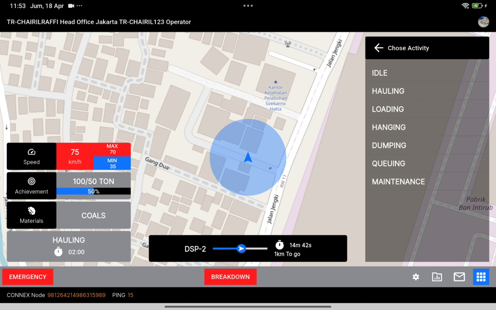

# Mobile Engineer Challenge - Chairil Rafi Purnama

[](https://drive.google.com/file/d/1dUhp91WXu6B4jdpoGVqN921nOBNb_GVB/view?usp=share_link)

## Challenge
- Slicing UI (45 point) 
    - Register Device (Installation Wizard) Page (✅)
    - Waiting Activation Page (✅)
    - Login Page (✅)
    - Success and Failed Login Pop-up (✅)
    - On Duty Page with dummy data and static image (✅)
    - New Message Pop-up (✅)
    - Chat Page (✅)
- API and Websocket Integration :
    - Installation Wizard Page (✅) 
        - Generate a device ID using a random string. Check the device status via API using the device ID in ‘get device by id’ endpoint
        - Connect  and subscribe to the WebSocket channel /equipments/devices/$deviceId/activated using Centfigue v.0.8.0
        - Based on response in step i, there are some condition:
            - If the device has not been registered (the response is Device Not Found!), then register it using the ‘register device’ endpoint
            - If it is registered but not yet activated (value of is_active is false),  it should be redirected to the Waiting Activation Page 
            - Then, activate the device manually via postman using ‘update activation’ endpoint (please login using ‘login admin’ first). Make sure  is_active value is true, it will automatically send data  via websocket.
            - If the device status is active (based on is_active value), or if WebSocket has sent data with the value of data['is_active'] is true, it will automatically be directed to LoginPage
    - Login Page (✅) 
        - Before login to your device, you must login as admin with the endpoint ‘login admin’ 
        - Please create manually in postman, follow the instructions, it's mandatory:
            - user data use ‘create user’ endpoint
            - kimper with ‘create kimper’ endpoint
            - units manually in postman.
        - Export last data roaster using endpoint ‘export roaster’, if successful, save response as .xlxs file
        - Add your equipment data in that excel (don’t change any existing data) . 
        - Import the excel use ‘import roaster’ endpoint (follow the instructions in postman).
        - Integrate the Login Page with the API (login tablet endpoint) and handle the following response conditions: 
            - Success login
            - Failed login
    - New chat pop-up (✅) 
        - Subscribe to websocket channel /monitoring/messages/equipments/$unitId (10 point)
        - To send a new message to your device, login with the endpoint ‘login admin’ and  use ‘send message from web’ endpoint to get a new message.
        - If a new message arrives, show a new chat pop-up. If the user slides to "balas" or "mengerti," close the pop-up (10 points).
    - Chat page (✅) 
        - Use the ‘get template message’ endpoint  to fetch message templates (5 points).
        - Integrate with API to fetch all messages using ‘get all messages’ endpoint  (5 point)
        - Display any real-time messages from the WebSocket channel (point c.ii) on the Chat Page immediately (15 points).
        - Send new message to API using ‘send message’ endpoint with the request body  (5 point)

- Implement Clean Architecture (Data layer, Domain Layer, Presentation Layer) (✅) 
- Implement Unit testing or Integration testing (✅) 
- Using state management like Bloc (Preferable), GetX, or others and Implement Dependency Injection (✅) 
- Create technical documentation (✅) 
- Build and running on linux (✅) 

## Teknologi & Framework
- **Flutter**: 3.29.2 (Stable)
- **State Management**: GetX with StateMixin
- **REST API**: Dio
- **Local Storage**: GetStorage
- **WebSocket**: Centrifuge (wss)
- **Environment Config**: flutter_dotenv
- **Clean Architecture**: MVVM

## Struktur File
- **lib/core/** – Konfigurasi Aplikasi dari color palette, constant, dimens, database, service & utility
- **lib/domain/** - Base Model & UseCase
- **lib/presentations/** – UI & fitur modular (setiap halaman / fitur mempunyai controller, model, view, repository tersendiri)
- **integration_test/** – Integration Testing
- **.env** – Konfigurasi base URL dan WebSocket
- **.github/workflows/flutter_linux.yml** – CI/CD untuk build Linux

## Cara Menjalankan Aplikasi

1. Clone repository ini:
   ```bash
   git https://github.com/chairilrafi11/synapsis
   cd your-repo-name

2. Install Dependency
   ```bash
   flutter pub get

3. Setup Environment di file .env
    ```bash
    BASE_URL_PRODUCTION = "https://dev-api-fms.apps-madhani.com/v1"
    BASE_URL_STAGGING = ""
    WEBSOCKET_CHANNEL_URL = "wss://dev-wss.apps-madhani.com/connection/websocket"
    WEBSOCKET_PREFIX_CHANNEL_URL = "ws/fms-dev"
    IS_PRODUCTION = "true"
    DEBUG = "true"

4. Jalankan Aplikasi
   ```bash
   flutter run
   
**Aplikasi sudah terdapat Database, setelah user login apabila memjalankan aplikasi kembali maka user tidak perlu login kembali**

## Cara Membuild Linux Via CI/CD GithubActions

Project ini sudah terkonfigurasi untuk build otomatis aplikasi Flutter di Linux melalui GitHub Actions.

Setiap push ke branch main akan memicu workflow yang:

- Build project untuk Linux
- Upload hasil build (.deb) sebagai artifacts

Download Hasil Build
Kunjungi tab Actions di GitHub repository, pilih workflow terakhir, dan unduh file .deb pada bagian Artifacts.

## Developer

- Chairil Rafi Purnama
- Email: chairilraffi@gmail.com
- LinkedIn : https://www.linkedin.com/in/chairil-rafi-705510180/$0